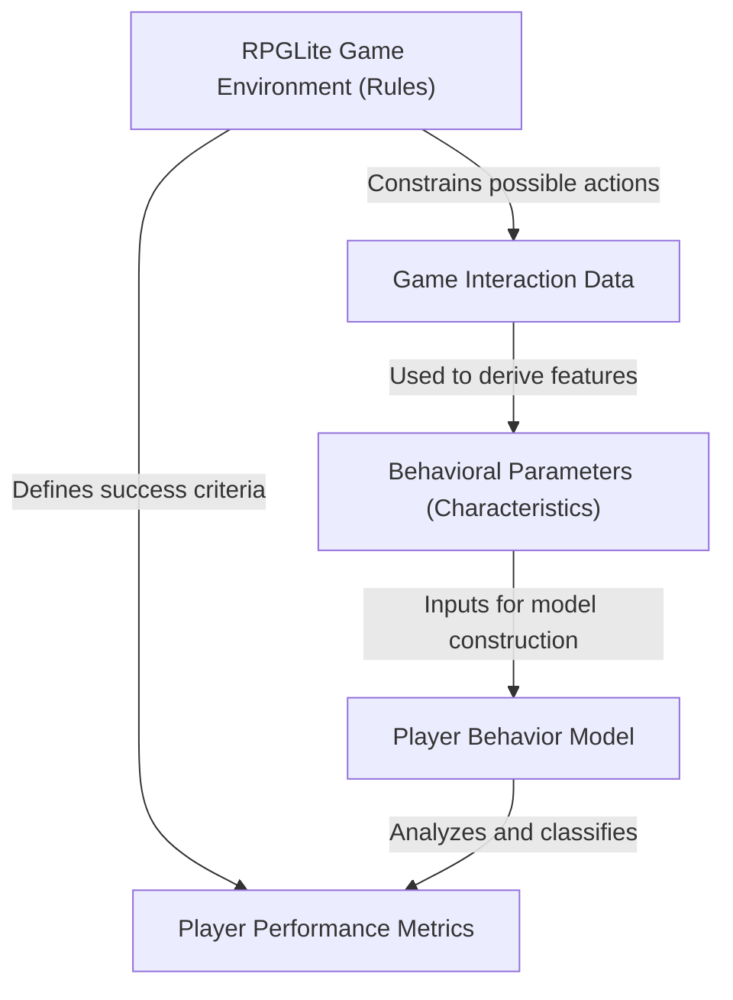
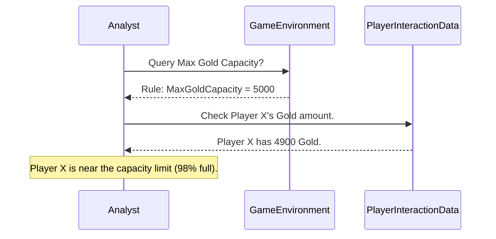
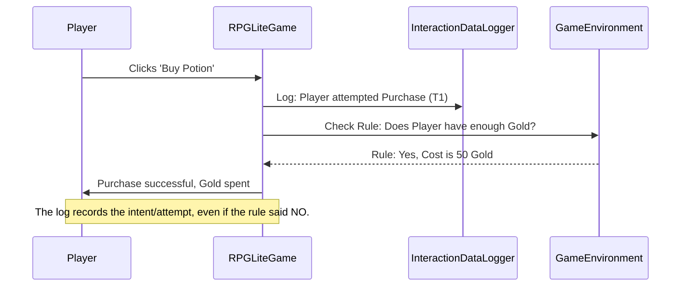
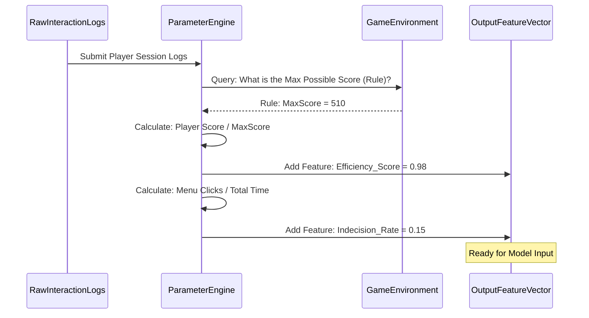
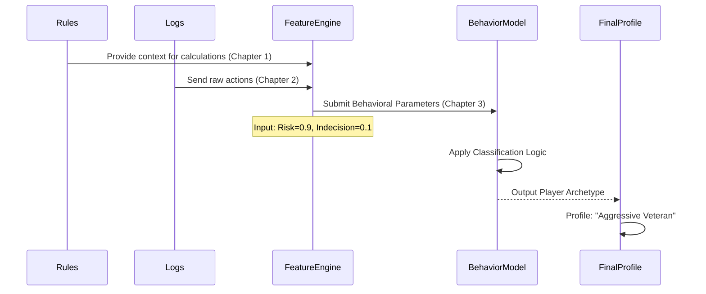
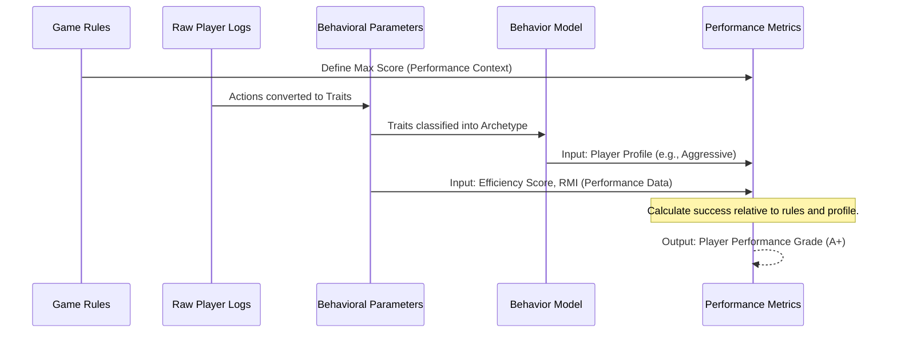

# Tutorial: Behavior-modeling-and-analysis-for-the-mobile-game-app-RPGLite

This project focuses on studying how players engage with the mobile game *RPGLite*. It achieves this by logging and analyzing **Game Interaction Data** alongside scores and other *Behavioral Parameters* extracted from play sessions. The ultimate aim is to synthesize this information into a comprehensive **Player Behavior Model** that explains if and how players successfully learn the game’s rules and enhance their overall *performance level*.


## Visual Overview



## Chapters

1. [RPGLite Game Environment (Rules)
](01_rpglite_game_environment__rules__.md)
2. [Game Interaction Data
](02_game_interaction_data_.md)
3. [Behavioral Parameters (Characteristics)
](03_behavioral_parameters__characteristics__.md)
4. [Player Behavior Model
](04_player_behavior_model_.md)
5. [Player Performance Metrics
](05_player_performance_metrics_.md)


# Chapter 1: RPGLite Game Environment (Rules)

Welcome to the start of our project! We are going to analyze how people play the mobile game RPGLite. But before we look at any actual player data, we must first understand the game itself.

Imagine you are watching a new sport for the first time, like cricket. If you see someone running around, how do you know if they are playing well? You can't, unless someone explains the rules! What is a 'wicket'? What counts as a point?

The **RPGLite Game Environment (Rules)** is exactly this—it is the instruction manual for the game. It defines the structure, constraints, and how scores are calculated in RPGLite.

### Why Do We Need the Game Environment Abstraction?

We need to understand the rules because every single player action we measure must be interpreted *relative* to the system the player is operating in.

**Use Case:** A player achieves a high score of 500 points.

1.  **Without knowing the rules:** Is 500 good? We don't know. Maybe the maximum possible score is 1,000,000. In that case, 500 is terrible.
2.  **With the rules defined:** If the environment tells us that the maximum possible score for that level is 510, then 500 is an *excellent* score.

The RPGLite Game Environment abstraction helps us establish a baseline context so we can accurately judge player behavior and performance.

---

### Key Components of the Environment

The game environment is a conceptual abstraction that holds all the constant truths about RPGLite. These truths fall into a few categories:

| Concept | Description | Example Rule |
| :--- | :--- | :--- |
| **Scoring Mechanics** | How points, gold, or rewards are earned. | Killing a standard enemy grants 10 gold and 5 points. |
| **System Constraints** | The fixed limits and boundaries of the game system. | A character's maximum possible level is 100. |
| **Difficulty Scaling** | How costs increase or enemies become stronger over time. | Enemy health increases by 15% in every new zone. |

We model these rules often using simple Python constants or configuration files.

### Defining Rules in Code

To start building our analysis project, we first define these critical rules. Let’s look at how we might define simple scoring mechanics.

```python
# rpglite_environment.py (Conceptual file holding the rules)

# --- Scoring Mechanics ---
BASE_SCORE_PER_KILL = 10
BONUS_SCORE_PER_BOSS = 50

# --- Game Constraints ---
MAX_CHARACTER_LIVES = 3
MAX_ITEM_RARITY = 5

print(f"Standard kill value: {BASE_SCORE_PER_KILL} points.")
# Output: Standard kill value: 10 points.
```
This small file acts as our "rulebook." By establishing these constant values, we ensure that when we analyze player data later, we are all using the same definition of what a "point" is.

### How the Environment Provides Context

The Game Environment acts as a reference library for all subsequent analytical steps. When we receive data about a player's performance, the environment immediately gives that data meaning.

Let's see this interaction flow conceptually:



In the sequence above, the player’s actual gold (4900) only becomes meaningful (near capacity) once it is compared against the limit defined in the **Game Environment**. If we didn't check the Environment first, 4900 gold might seem like a small amount.

### Solving the Use Case

Let's return to our use case: Interpreting a player score of 500.

Suppose the environment defines a dynamic difficulty increase: higher levels cost more time to complete, which limits the *rate* at which a player can earn points.

By combining the player's achieved score with the expected score defined by the rules, we can calculate a meaningful performance metric (which we will cover in [Player Performance Metrics](05_player_performance_metrics_.md)).

For now, the key takeaway is that the Environment defines the scale:

```python
# Analyzing score relative to the environment rules

PLAYER_SCORE = 500
EXPECTED_MAX_SCORE = 510  # This rule comes from the environment

Efficiency = PLAYER_SCORE / EXPECTED_MAX_SCORE

if Efficiency > 0.95:
    print("Player showed highly efficient performance.")
else:
    print("Performance was average or low.")
# Output: Player showed highly efficient performance.
```
We rely completely on the **RPGLite Game Environment (Rules)** to set `EXPECTED_MAX_SCORE`. Without it, the calculation fails, and our behavior analysis is meaningless.

### Conclusion and Transition

In this chapter, we established that before analyzing player behavior, we must first define the static **RPGLite Game Environment (Rules)**. This environment provides the context, constraints, and scoring mechanics necessary to interpret player actions accurately.

Now that we know the rules of the game, the next crucial step is to gather the data generated when players interact with this environment. In the next chapter, we will dive into [Game Interaction Data](02_game_interaction_data_.md).


# Chapter 2: Game Interaction Data

In [Chapter 1: RPGLite Game Environment (Rules)](01_rpglite_game_environment__rules__.md), we established the rulebook for RPGLite. We now know what a good score is and what the maximum limits are. The rules give us the necessary *context*.

But knowing the rules is only half the battle. If a player achieves a great score, how do we know *how* they did it? Did they use the strongest weapon? Did they avoid mistakes?

To answer these questions, we need to capture the step-by-step engagement of the player. This is where the concept of **Game Interaction Data** comes in.

---

### What is Game Interaction Data?

Think of analyzing player performance like analyzing a student's education.

1.  **Final Grade (Performance Score):** The student got an 'A'. (Great result!)
2.  **Study Habits (Interaction Data):** Did they study for 10 hours straight the night before, or did they study 1 hour every day for a month?

The **Game Interaction Data** captures the *process*—the complete record of actions, decisions, and clicks a player makes while playing RPGLite. It is the minute-by-minute log of their active engagement. Analyzing this log helps us understand *why* they succeeded or failed.

### Use Case: Finding the Friction Point

Let's use a specific example.

**Use Case:** Two players, Alice and Bob, both reach a final score of 100 points. Alice took 5 minutes to get there, and Bob took 15 minutes. Why the huge difference in time?

The final score (100) is the same. To understand the efficiency difference, we must look at the logs of their interactions.

If we only look at the final result, we miss crucial details like:
*   Did Bob spend 10 extra minutes buying and selling items repeatedly? (Indicates indecision or optimization attempt.)
*   Did Alice use a complex shortcut ability that saved her time? (Indicates advanced skill.)

### The Components of Interaction Data

Interaction data is a stream of discrete events, each tagged with a time and details about the action. In RPGLite, these might include:

| Interaction Type | Description | Example Data Logged |
| :--- | :--- | :--- |
| **Movement Logs** | Player movement across the map. | `Time T1: Player moved right 5 units.` |
| **Combat Logs** | Using abilities or attacking enemies. | `Time T2: Used 'Firebolt' on Enemy ID 4.` |
| **Inventory Events** | Equipping items or consuming resources. | `Time T3: Equipped item 'Steel Helmet'.` |
| **UI Clicks** | Opening menus, checking stats, or pausing. | `Time T4: Clicked 'Inventory' button.` |

All these small actions, when stitched together chronologically, form the complete behavioral transcript of the player.

### Data Structure: A Simple Log

We capture this stream of actions as log entries, typically using timestamps to ensure we know the exact order of events.

```python
# Data capturing the raw interactions of a player session

player_session_log = [
    {
        "timestamp": "10:05:01",
        "event_name": "Movement",
        "action": "Start Run"
    },
    {
        "timestamp": "10:05:05",
        "event_name": "Ability_Use",
        "action": "Power Strike"
    },
    {
        "timestamp": "10:05:25",
        "event_name": "UI_Click",
        "action": "Opened Help Menu" # Possible friction point
    }
]

# We can see the player paused the action 20 seconds after the fight started.
```
This data is the foundation of our analysis because it shows us exactly what the player was doing at the moment of success, failure, or delay.

### The Interaction Data Flow

The Interaction Data works closely with the [RPGLite Game Environment (Rules)](01_rpglite_game_environment__rules__.md). The player's action is recorded first, and then the rules dictate the outcome.


Notice that the **Interaction Data Logger** records the player's attempt (`Player attempted Purchase (T1)`) regardless of the outcome dictated by the **Game Environment**. This is key, as failed attempts (like trying to use an ability when it's on cooldown) are critical behavioral signals.

### Solving the Use Case

Let's return to Alice (5 minutes, 100 points) and Bob (15 minutes, 100 points). We need the interaction data to explain the difference.

We examine Bob’s logs around minute 5:

```python
# Example of Bob's log data (around the time Alice finished)

Bob_Log_Slice = [
    {"time": "10:05:00", "event": "Check Stats"},
    {"time": "10:05:30", "event": "Check Stats"},
    {"time": "10:06:00", "event": "Check Stats"},
    {"time": "10:06:30", "event": "Opened Inventory"},
    # ... This continues for 10 minutes
]

# Bob is spending too much time navigating menus instead of fighting.
```

By filtering the interaction data, we can see that Bob spent 10 minutes repeatedly opening and closing menus or checking his stats. This inefficiency—a pattern captured by the interaction logs—explains the massive time difference.

This ability to track the *rate* and *type* of player actions is essential, as it allows us to define qualities like efficiency, caution, or decisiveness, which is the focus of our next chapter.

### Conclusion and Transition

The **Game Interaction Data** is the behavioral diary of the player. It captures every single action taken within the [RPGLite Game Environment (Rules)](01_rpglite_game_environment__rules__.md). By collecting and timestamping these detailed actions (like movement, ability usage, and clicks), we get a rich, chronological history of the player’s experience.

We now have the rules (Chapter 1) and the raw actions (Chapter 2). The next step is to process these raw actions into measurable human traits. In the next chapter, we will learn how to define and calculate [Behavioral Parameters (Characteristics)](03_behavioral_parameters__characteristics__.md).

# Chapter 3: Behavioral Parameters (Characteristics)

In the previous chapters, we established the rules of the game in the [RPGLite Game Environment (Rules)](01_rpglite_game_environment__rules__.md) and collected the complete record of player actions in the [Game Interaction Data](02_game_interaction_data_.md).

We now have all the ingredients: the static context (the rules) and the dynamic history (the logs). However, the raw logs are still too detailed. Imagine having a conversation with someone where they describe every single second of their day—it would take forever to figure out what they are like!

We need to summarize these thousands of actions into meaningful, measurable traits. This is the purpose of defining **Behavioral Parameters (Characteristics)**.

---

### What are Behavioral Parameters?

**Behavioral Parameters** (often called *features* in data science) are the quantitative summaries derived from the raw interaction data. They are calculated variables that capture aspects of the player’s strategy, style, and efficiency.

These parameters transform noisy, sequential actions (like `clicked attack`, `moved left`, `opened map`) into clean, statistical measurements (like `attack rate`, `movement efficiency`, `indecision score`).

These parameters are the actual inputs we will feed into our behavior model in [Chapter 4: Player Behavior Model](04_player_behavior_model_.md).

### Use Case: Measuring Caution

Let's return to the concept of raw logs. Suppose a player is fighting a boss. Their log might look like this:

```
T1: Player takes damage.
T2: Player uses Ability X.
T3: Player takes damage.
T4: Player uses Health Potion. (Heals)
T5: Player takes damage.
T6: Player uses Health Potion. (Heals)
```

If we just look at the raw logs, we see two healing events. But what behavioral *characteristic* does this portray?

If the game rules (Chapter 1) state that Health Potions are very rare and costly, using two potions in five seconds suggests the player is very **Cautious**. If the potions are cheap and abundant, using two suggests slightly less caution, but perhaps just good resource management.

A **Behavioral Parameter** is the calculated number that defines this "Caution" characteristic.

### Direct vs. Derived Parameters

Behavioral parameters usually fall into two categories:

| Parameter Type | Description | Example Metric |
| :--- | :--- | :--- |
| **Direct Parameters** | Easily counted or calculated directly from a single data point. | Total score achieved, total time spent, number of items bought. |
| **Derived Characteristics** | Complex features that require combining multiple actions and game rules to infer a player trait. | Risk tolerance, efficiency score, resource management skill. |

The most valuable data in behavior modeling often comes from the **Derived Characteristics** because they interpret the *intent* behind the actions.

### Calculating a Derived Characteristic: Speed

Let’s calculate a core characteristic: **Speed of Movement**. This is a measure of efficiency—how quickly the player navigates the game world.

We use the raw log entries from [Game Interaction Data](02_game_interaction_data_.md) and the time intervals captured between them.

**Input Log (from a 30-second window):**

```python
# Interaction log snippet with timestamps
log_data = [
    {"time": 0, "event": "Movement_Start"},
    {"time": 10, "event": "Movement_Stop"}, # 10 seconds of movement
    {"time": 25, "event": "Movement_Start"},
    {"time": 30, "event": "Movement_Stop"}  # 5 seconds of movement
]

# Calculate the parameter: Movement Efficiency
total_time = 30
total_movement_duration = (10 - 0) + (30 - 25)

# Calculate parameter
Speed_Parameter = total_movement_duration / total_time
print(f"Movement Speed Parameter: {Speed_Parameter:.2f}")
# Output: Movement Speed Parameter: 0.50 
```

A score of 0.50 means the player spent 50% of the session actively moving, while the rest of the time was spent fighting, paused, or navigating menus. This single parameter is much more useful to a behavior model than the four raw log entries combined.

### The Feature Extraction Pipeline

Creating these parameters is called **Feature Extraction**. This process must reference both the raw logs and the rules to ensure the resulting numbers are accurate and meaningful.

For instance, when calculating 'Risk Tolerance', the Parameter Engine needs to know from the **Game Environment** which abilities are considered "High Risk" (high damage, high cooldown) versus "Low Risk" (low damage, low cooldown).

Here is how the data flow looks when extracting a set of parameters:



The result of this process is the **Feature Vector**: a list or array of the calculated parameters, such as `[0.98, 0.15, 0.50, ...]`—each number represents a specific behavioral trait extracted from the raw data.

### Conclusion and Transition

We have successfully moved from understanding the rules (Chapter 1) and collecting the actions (Chapter 2) to summarizing those actions into meaningful **Behavioral Parameters (Characteristics)**. These parameters, like "Efficiency Score" or "Indecision Rate," are analytical building blocks that quantify a player's style.

Now that we have these quantitative inputs, the final step is to use them to construct an actual model that can classify or predict player behavior. In the next chapter, we will introduce the [Player Behavior Model](04_player_behavior_model_.md).


# Chapter 4: Player Behavior Model

We have come a long way! In the first three chapters, we built the foundation for our analysis:
1.  We defined the [RPGLite Game Environment (Rules)](01_rpglite_game_environment__rules__.md).
2.  We collected the raw [Game Interaction Data](02_game_interaction_data_.md).
3.  We calculated concise [Behavioral Parameters (Characteristics)](03_behavioral_parameters__characteristics__.md), such as 'Efficiency Score' and 'Risk Tolerance.'

We now have all the numbers necessary to describe *what* a player did and *how* they did it. But what do these numbers *mean*? If a player has a Risk Tolerance of 0.9, are they a skilled strategist or a reckless beginner?

The **Player Behavior Model** is the final analytical output that answers this question. It acts as the ultimate engine, taking all the calculated parameters and converting them into a meaningful profile or classification of the player.

---

### What is the Player Behavior Model?

Imagine you are a detective examining several clues (our behavioral parameters). You don't just list the clues; you build a coherent theory about the suspect.

The **Player Behavior Model** is that comprehensive theory. It is a structure, often built using machine learning algorithms, designed to define how players act and learn within RPGLite. It profiles the player by tying their measurable actions to psychological or strategic characteristics.

**Goal of the Model:** To transform the numbers (the feature vector) into an understandable label (the behavior profile).

| Input to Model | Output of Model |
| :--- | :--- |
| **Numerical Traits** (Calculated Parameters) | **Behavioral Profile** (Classification/Prediction) |
| Risk Tolerance: 0.9, Indecision Rate: 0.1 | "Aggressive, Highly Optimized Player" |
| Risk Tolerance: 0.2, Indecision Rate: 0.6 | "Cautious, Indecisive Learner" |

### Use Case: Defining Player Archetypes

In RPGLite, players generally fall into distinct strategic groups. We need the model to automatically sort them.

**Use Case:** We analyzed two players, Chris and Dana. Chris achieved a high final score, and Dana achieved an average score. We want to know if Chris achieved the score by being incredibly fast (efficient) or incredibly risky (high tolerance).

The **Player Behavior Model** solves this by classifying their entire behavioral profile based on the parameters we feed it. It doesn't just look at the final score; it defines the *strategy* that led to that score.

### How the Model is Constructed

The Player Behavior Model relies on established data science techniques, primarily **Classification**.

**Classification** is the process of training the model to recognize patterns in the input parameters and assign them to predetermined categories (archetypes).

#### Step 1: Defining the Archetypes (Labels)

Before we train the model, we must first define the possible output labels (the player types). These are based on the core rules defined in Chapter 1.

For RPGLite, let's define two simple types based on how they approach the game's risk/reward mechanics:

1.  **Aggressive Player:** High risk tolerance, low indecision. They rush, use high-damage abilities, and rarely pause.
2.  **Cautious Player:** Low risk tolerance, high indecision. They heal early, pause often to check menus, and prefer safe, low-damage abilities.

#### Step 2: Applying the Classification Logic

The model takes the input parameters calculated in Chapter 3 and runs them through its logic (which can be as simple as an `if/else` statement or as complex as a neural network).

Let's simulate the classification with simple logic based on two parameters: `risk_score` (0 to 1) and `indecision_rate` (0 to 1).

```python
# Simplified Player Classification Function

def classify_player_archetype(risk_score, indecision_rate):
    # Rule 1: High Risk & Low Indecision = Aggressive
    if risk_score >= 0.8 and indecision_rate < 0.2:
        return "Aggressive Veteran"
    
    # Rule 2: Low Risk & High Indecision = Cautious
    elif risk_score <= 0.3 and indecision_rate >= 0.5:
        return "Cautious Learner"
    
    else:
        return "Average Player"

# These rules ARE the behavior model logic.
```

### The End-to-End Behavior Modeling Pipeline

The Player Behavior Model sits at the end of our data analysis pipeline, consuming all the processed information from the previous steps.

This diagram illustrates how all the concepts link together to produce the final profile:



### Solving the Use Case with the Model

Let's apply our simplified classification model to Chris and Dana, the two players mentioned in our use case.

We assume the [Behavioral Parameters (Characteristics)](03_behavioral_parameters__characteristics__.md) engine has provided the following feature vectors:

| Player | Risk Score | Indecision Rate |
| :--- | :--- | :--- |
| **Chris** | 0.95 (Very High) | 0.05 (Very Low) |
| **Dana** | 0.40 (Medium) | 0.70 (High) |

Now, we feed these inputs into the Player Behavior Model:

```python
# Applying the model to Chris and Dana
# (Using the classify_player_archetype function defined earlier)

# Chris: High risk, low indecision
chris_type = classify_player_archetype(risk_score=0.95, indecision_rate=0.05)

# Dana: Medium risk, high indecision
dana_type = classify_player_archetype(risk_score=0.40, indecision_rate=0.70)

print(f"Chris's Profile: {chris_type}")
print(f"Dana's Profile: {dana_type}")
# Output: Chris's Profile: Aggressive Veteran
# Output: Dana's Profile: Average Player
```

The output of the **Player Behavior Model** is clear: Chris is an **Aggressive Veteran**. His high score was achieved through a fast, high-risk strategy (Risk 0.95, Indecision 0.05). Dana, by contrast, is categorized as an 'Average Player,' indicating a less defined or more tentative strategy.

This classification allows us to analyze not just *what* happened, but *why* it happened, by linking performance directly back to an identifiable playstyle.

### Conclusion and Transition

The **Player Behavior Model** represents the culmination of our analytical steps. It takes the summarized numerical traits derived from player interactions and classifies them into meaningful player types (archetypes). This structure allows us to understand the underlying strategy and skill level of any player in RPGLite.

Now that we know *what kind* of player someone is (their behavioral model), the final piece of the puzzle is determining *how successful* that particular style was. In the next and final chapter, we will learn how to quantify that success using [Player Performance Metrics](05_player_performance_metrics_.md).


# Chapter 5: Player Performance Metrics

We have reached the final stage of our analysis pipeline! In the previous chapters, we defined the rules of the game ([Chapter 1: RPGLite Game Environment (Rules)](01_rpglite_game_environment__rules__.md)), tracked player actions ([Chapter 2: Game Interaction Data](02_game_interaction_data_.md)), quantified their style using numerical traits ([Chapter 3: Behavioral Parameters (Characteristics)](03_behavioral_parameters__characteristics__.md)), and used those traits to define their playstyle ([Chapter 4: Player Behavior Model](04_player_behavior_model_.md)).

We now know *who* the player is (e.g., an "Aggressive Veteran") and *how* they play. But one crucial question remains: **Were they successful?**

The **Player Performance Metrics (PPMs)** are the measurable outcomes used to answer this question. They transform our analysis from "how they played" into "how well they played." PPMs are essentially the player’s report card for RPGLite.

---

### What are Player Performance Metrics?

A player might be classified as an "Aggressive Veteran," which sounds cool, but if that aggression leads to them failing the level every time, then the style is actually unsuccessful.

PPMs provide the objective proof of success or failure. They go beyond the raw score to judge two crucial things:

1.  **Immediate Success:** Did they achieve a high score or complete the goal efficiently? (Explicit Score).
2.  **Long-term Progress:** Are they improving over time, or have they mastered the core mechanics? (Longitudinal Assessment).

### Use Case: Measuring Improvement

Let’s use a concrete example where PPMs are essential:

**Use Case:** Player X is consistently classified as an "Average Player" (medium risk, medium indecision) across all 10 sessions they played last week. Is this player stuck, or are they quietly improving their *skill* within that average profile?

If we only look at the behavior model, we might think they are static. PPMs, however, can track subtle gains, like higher scores in the same amount of time, proving they are learning.

### Types of Performance Metrics

PPMs evaluate success in two key ways:

| Metric Type | Description | Example Metric |
| :--- | :--- | :--- |
| **Explicit Metrics** | Final, easy-to-read outcomes of a single session. This is the simplest measure of performance. | Final Score, Total Gold Earned, Level Completed Status (Win/Loss). |
| **Longitudinal Metrics** | Metrics tracking change, learning, and skill enhancement across many sessions. | **Rule Mastery Index**, Improvement Rate (Score per hour growth), Efficiency Gain. |

While the final score is an important *Explicit Metric*, the **Longitudinal Metrics** are critical for determining if a player is mastering the game system.

### Calculating a Performance Metric: Mastery Index

A key measure of success in RPGLite is the player's ability to efficiently use resources, a concept heavily defined by the [RPGLite Game Environment (Rules)](01_rpglite_game_environment__rules__.md).

Let's define a simple **Rule Mastery Index (RMI)** based on how few mistakes a player makes (mistakes being using resources inefficiently or failing rule checks).

We need the total number of rule violations (e.g., trying to use an ability on cooldown, buying items when inventory is full) compared to the total number of actions taken. We get the actions from [Game Interaction Data](02_game_interaction_data_.md).

```python
# Calculating the Rule Mastery Index for a session

total_actions = 500 # From Interaction Data logs
rule_violations = 10 # Failed attempts, resource waste

# RMI is the percentage of actions that were correct (non-violating)
RMI = (total_actions - rule_violations) / total_actions

print(f"Session Rule Mastery Index: {RMI:.3f}")
# Output: Session Rule Mastery Index: 0.980
```
A high RMI (like 0.980) shows the player understands the system and is performing optimally, suggesting a high degree of game mastery.

### Tracking Performance Over Time

The most powerful use of PPMs is tracking improvement, which requires looking at the longitudinal metrics across multiple sessions. This lets us measure if the player is successfully "picking up on the game’s rules."

We can compare a parameter (like the RMI we just calculated) from Session 1 to Session 10.

```python
# Measuring improvement over multiple sessions

rmi_session_1 = 0.65  # Many violations when starting
rmi_session_10 = 0.98 # Few violations after learning

# Calculate performance enhancement rate
enhancement_rate = rmi_session_10 - rmi_session_1

print(f"Performance Enhancement Rate: {enhancement_rate:.2f}")
# Output: Performance Enhancement Rate: 0.33
```
An enhancement rate of 0.33 is a strong signal that the player is successfully learning the rules and improving their performance level. This positive metric can be tied back to their "Average Player" profile (from Chapter 4), confirming that while their *style* remains average, their *skill* is rapidly climbing.

### The Full Analysis Pipeline

Player Performance Metrics provide the final, digestible evaluation for the player. They sit at the end of the entire system, consuming all prior outputs to deliver a final grade.

The diagram below illustrates how the five core concepts we covered in this tutorial work together:



### Solving the Use Case

Let's return to Player X, who maintained an "Average Player" profile across 10 sessions. We want to know if they were improving.

We found that while their strategy (medium risk/medium indecision) didn't change enough to shift their archetype, their underlying execution became much cleaner, as seen in the Rule Mastery Index (RMI):

| Session | Behavioral Archetype | Rule Mastery Index (RMI) |
| :--- | :--- | :--- |
| **Session 1** | Average Player | 0.65 (High Error Rate) |
| **Session 10** | Average Player | 0.98 (Low Error Rate) |

The **Player Performance Metrics** clearly show that despite having the same behavioral label, Player X exhibited a massive **Performance Enhancement Rate** (0.33 increase). This proves they successfully mastered the game's mechanics, even if they never adopted an "Aggressive" or "Cautious" *style*.

This is why PPMs are crucial: they provide the final quantitative validation of learning and skill acquisition.

### Conclusion

In this final chapter, we defined the **Player Performance Metrics (PPMs)** as the essential tools for evaluating player success and progress. By calculating explicit metrics (like the final score) and longitudinal metrics (like the Rule Mastery Index and Enhancement Rate), we gain the ability to create a comprehensive report card for every player.

These metrics allow us to determine if a player is improving, mastering the game's rules, and achieving high levels of performance, regardless of their specific behavioral archetype.

This concludes our tutorial on behavior modeling and analysis for RPGLite. We successfully moved from defining the environment to delivering a final performance evaluation.
